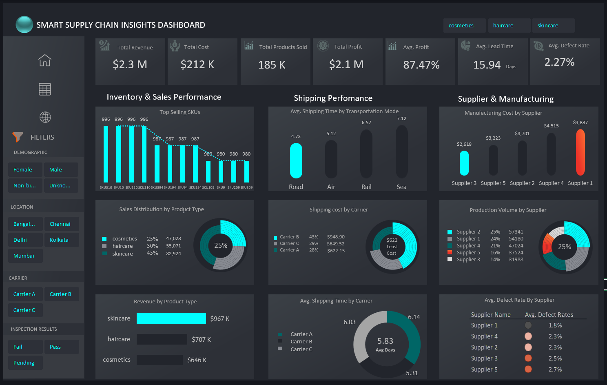

# Supply Chain Management

## Introduction
In a fast paced world, real time data serves as the key element in ensuring operational excellence in our businesses - It is the key metric to ensuring success on our business practices. With proper Supply Chain Management we are able to provide steady flow of products from the manufacturer to the consumer (customer).  As much as we priotize customer satisfaction, we also want to make enough profits to provide enough resources for continuous production. Data Analysts help us understand the data by determining the organisation's performance over time because numbers never lie.
## Problem Statement
To develop an interactive Excel dashboard that provides real-time insights into key supply chain metrics such as inventory levels, product performance, order fulfillment efficiency, and supplier reliability. The goal is to enable the Stakeholders to make data-driven decisions that improve operational efficiency, reduce delays, optimize shipping costs, and enhance overall customer satisfaction. This dashboard will serve as a centralized tool for tracking product availability, sales trends, shipping performance, and production quality, allowing stakeholders to proactively address bottlenecks and manage supply chain risks effectively.
## Project Overview
This Excel- based result addresses the key supply chain challenges; product performance, inventory management, supplier reliability, Order fulfilment. This undertaking aims to streamline processes, reduce cost meaning more profits and provide a centralized system for the stakeholders to navigate complexities and drive meaningful conclusions.
The dataset containes 402 entries and 25 columns.
- Product type:	The category or classification of a product.
- SKU: Stock Keeping Unit, a unique identifier for each product.
- Availability:	Indicates whether a product is in stock or out of stock.
- Number of products sold: Total quantity of units sold for each product.
- Revenue generated:	Total income earned from product sales.
- Customer demographics:	Information about customers such as age, gender, and location.
- Stock levels:	Current quantity of products available in inventory.
- E.t.c
## Tools/Technologies Used
- Excel: For cleaning, Preparation, Transformation.
- Power Query
- Data validation to ensure integrity.
## Key Findings
The findings have been divided into four categories to provide a clear snapshot for the stakeholders.

#### Key Metrics/ KPIs
- Total Revenue: $2.3M, showing overall sales performance.
- Total Cost: $212K, reflecting operational expenses.
- Total Products Sold: 185K units, indicating sales volume.
- Total Profit: $2.1M, highlighting profitability.
- Avg. Profit Margin: 87.47%, showing profit efficiency.
- Avg. Lead Time: 15.94 days, measuring order fulfillment speed.
- Avg. Defect Rate: 2.27%, indicating production quality.
#### Inventory & Sales Performance
1. The visualization bar chart display inventory levels for Top Slelling SKUs (eg. SKU310, SKU10, SKU110, SKU210, SKU394, SKU194, SKU94, SKU294, SKU109, SKU9, SKU209,SKU309).
-- This helps Identify stock availabilty & potential shortages.

2. Donut chart showing sales distribution: Skincare (45%, 82,924 units), Haircare (30%, 55,071 units), Cosmetics (25%, 47,028 units).
-- Highlights product category performance.

3. Bar chart showing revenue for each Product: Skincare ($967K), Haircare ($707K), Cosmetics ($646K).
-- Identifies top revenue-generating categories.
#### Shipping Performance
To optimize shipping methods and costs we evaluate the following:
1. Avg. Shipping Time by Transport Mode: Bar chart showing Road (4.72 days), Air (5.12 days), Rail (6.57 days), Sea (7.12 days).
2. Shipping Cost by Carrier: Donut chart showing Carrier B (43%, $948.90), Carrier C (29%, $649.52), Carrier A (28%, $621.15).
3. Avg. Shipping Time by Carrier: Donut chart showing Carrier A (6.03 days), Carrier B (6.14 days), Carrier C (5.31 days). Showing Avg delivery time as approximately 6 days.

#### Supplier Performance
Insights for supplier perfomance and quality.
- Bar chart showing Supplier 1 ($4,887), Supplier 4 ($4,515), Supplier 2 ($3,223), Supplier 5 ($2,618), Supplier 3 ($701).
- Donut chart showing Supplier 2 (25%, 574,310 units), Supplier 1 (25%, 541,180 units), Supplier 4 (21%, 470,224 units), Supplier 5 (16%, 375,294 units), Supplier 3 (14%, 319,888 units).
- Lists defect rates: Supplier 1 (1.8%), Supplier 4 (2.3%), Supplier 2 (2.3%), Supplier 5 (2.5%), Supplier 3 (2.7%).

#### Filters
These filters allow users to segment data for targeted analysis.

## Insights and Recommendations
1. **Cost and Profit**: With a 87% Profit margin and Profit ($2.1M) on Revenue ($2.3M), I'ld say The business is doing very well as long as we continue managing cost control(Expenses) while reducing the average defect rates (2.27%) though small to decrease waste and increase Profits.
2. **Product and Inventory Management**: Monitor stock levels and adjust proactively especially for skincare products. Priotize restocking to avoid shortages due to high demand on the product.Skincare leads sales distribution at 45% (82,924 units) and generates the highest revenue ($967K), while Cosmetics lags at 25% (47,028 units) at $646K. Increase production efforts for Skincare and explore marketing strategies like offering Discounts to boost Cosmetics performance.
3. **Shipping Optimization**: Road shipping at 4.72 days is the fastest transport mode, while Sea at 7.12 days is the slowest. Shift more shipments to Road where feasible. Additionally, Carrier B (43%, $948.90) has the highest cost—negotiate rates or evaluate alternative carriers to reduce expenses.
4. **Supplier Performance**: Supplier 1 has the lowest defect rate (1.8%) and highest manufacturing cost ($4,887), indicating quality focus — consider maintaining this partnership while seeking cost efficiencies. Supplier 5 & 3, with a 2.7% & 2.5% defect rate respectively, provide the least number of products and still having high defect rates. It's high time to re-negotiate the deal and set some standards on the required products.

- ✅ Created by: **Morris Musyoki**
- ✅ Built with: **Microsoft Excel**
- ✅ Dataset: **SupplyChainDataset**
